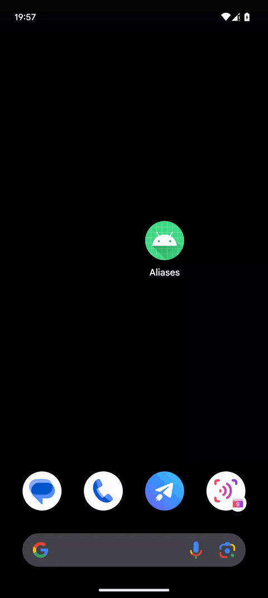

    

Aliases
=

Aliases – Android-приложение, реализующее возможность смены иконки приложения через механизм activity-alias. Это позволяет пользователям выбирать разные иконки, такие как стандартная, премиальная или праздничная.

