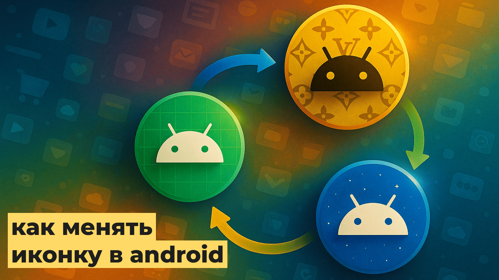
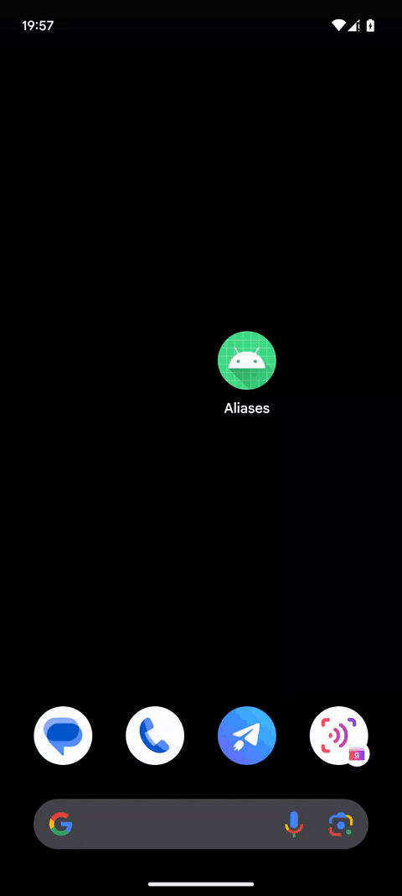

    

[![](https://img.shields.io/badge/Пост_в_Telegram-24A1DE?&style=for-the-badge&logo=data:image/svg+xml;base64,PHN2ZyB3aWR0aD0iNDciIGhlaWdodD0iMzkiIHZpZXdCb3g9IjAgMCA0NyAzOSIgZmlsbD0ibm9uZSIgeG1sbnM9Imh0dHA6Ly93d3cudzMub3JnLzIwMDAvc3ZnIj4KPHBhdGggZmlsbC1ydWxlPSJldmVub2RkIiBjbGlwLXJ1bGU9ImV2ZW5vZGQiIGQ9Ik0zLjE3MjkyIDE2LjQ2NjRDMTUuNTYyNSAxMS4wNjg0IDIzLjgyNDIgNy41MDk3NSAyNy45NTggNS43OTAzOEMzOS43NjA3IDAuODgxMjMxIDQyLjIxMzIgMC4wMjg0NTkzIDQzLjgxMTcgMC4wMDAzMDAyMzhDNDQuMTYzMiAtMC4wMDU4OTMwMyA0NC45NDkzIDAuMDgxMjM3OSA0NS40NTg1IDAuNDk0NDJDNDUuODg4NSAwLjg0MzMwMyA0Ni4wMDY4IDEuMzE0NTkgNDYuMDYzNCAxLjY0NTM3QzQ2LjEyIDEuOTc2MTUgNDYuMTkwNSAyLjcyOTY4IDQ2LjEzNDUgMy4zMTg0NkM0NS40OTQ5IDEwLjAzODcgNDIuNzI3NCAyNi4zNDcgNDEuMzE5NCAzMy44NzM4QzQwLjcyMzcgMzcuMDU4NyAzOS41NTA2IDM4LjEyNjUgMzguNDE1IDM4LjIzMUMzNS45NDY5IDM4LjQ1ODIgMzQuMDcyOCAzNi42IDMxLjY4MjMgMzUuMDMzQzI3Ljk0MTggMzIuNTgxIDI1LjgyODYgMzEuMDU0NyAyMi4xOTc4IDI4LjY2MkMxOC4wMDE3IDI1Ljg5NjggMjAuNzIxOCAyNC4zNzcxIDIzLjExMzIgMjEuODkzM0MyMy43MzkgMjEuMjQzMyAzNC42MTMzIDExLjM1MjMgMzQuODIzOCAxMC40NTVDMzQuODUwMSAxMC4zNDI4IDM0Ljg3NDUgOS45MjQ1MSAzNC42MjYgOS43MDM2NEMzNC4zNzc1IDkuNDgyNzYgMzQuMDEwNyA5LjU1ODI5IDMzLjc0NjEgOS42MTgzNkMzMy4zNzA5IDkuNzAzNTEgMjcuMzk1MyAxMy42NTMxIDE1LjgxOTMgMjEuNDY3M0MxNC4xMjMyIDIyLjYzMiAxMi41ODY4IDIzLjE5OTUgMTEuMjEwNCAyMy4xNjk3QzkuNjkyODkgMjMuMTM2OSA2Ljc3Mzg4IDIyLjMxMTcgNC42MDM5MSAyMS42MDY0QzEuOTQyMzQgMjAuNzQxMiAtMC4xNzMwMTkgMjAuMjgzOCAwLjAxMTE4MTUgMTguODE0NEMwLjEwNzEyNCAxOC4wNDkxIDEuMTYxMDQgMTcuMjY2NCAzLjE3MjkyIDE2LjQ2NjRaIiBmaWxsPSJ3aGl0ZSIvPgo8L3N2Zz4K)](https://t.me/foundout/286)

Aliases
=

Aliases – Android-приложение, реализующее возможность смены иконки приложения через механизм activity-alias. Это позволяет пользователям выбирать разные иконки, такие как стандартная, премиальная или праздничная.

